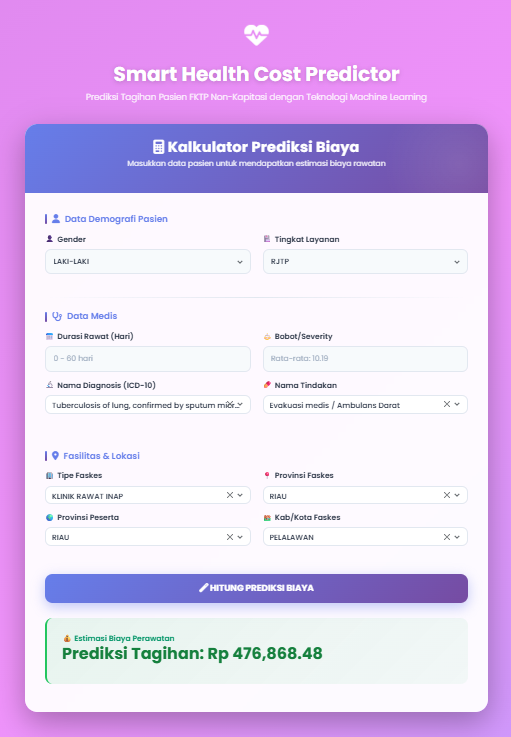

# 🏥 Prediksi Biaya Tagihan Pasien BPJS (FKTP Non-Kapitasi)


Project ini bertujuan untuk memprediksi estimasi biaya tagihan kesehatan pasien BPJS di Fasilitas Kesehatan Tingkat Pertama (FKTP) Non-Kapitasi. Model Machine Learning dibangun menggunakan algoritma **LightGBM (LGBMRegressor)** yang diintegrasikan ke dalam aplikasi web berbasis **Flask**.

---

## 📸 Tampilan Antarmuka



---

## 🚀 Dataset

* **Dataset:** Dataset sampel BPJS Kesehatan kasus Tuberkulosis, dengan studi kasus tahun 2022 berbasis data tahun 2021.
* [🔗 Klik disini untuk melihat Dataset tb_2021_kepesertaan.csv](https://drive.google.com/file/d/1nbd6zlghqanj38iEs_Rs9MBeB2hp298N/view?usp=drive_link).
* [🔗 Klik disini untuk melihat Dataset tb_fktp_nonkapitasi.csv](https://drive.google.com/file/d/1VjkQyyDTlp3q0EYsqG4fHPlN-v6yGP9I/view?usp=drive_link).


---

## 📋 Metodologi & Workflow (Jobdesk)

Berdasarkan proses pengembangan model, berikut adalah tahapan yang dilakukan dalam project ini:

### 1. Exploratory Data Analysis (EDA)
* **Data Understanding:** Inspeksi awal, pemuatan data, dan penentuan *Primary Table* vs *Related Table*.
* **Data Merging:** Penamaan struktur tabel berdasarkan `PSTV01` (Nomor Peserta) dan penggabungan tabel (*merging*).
* **Cleaning:** Normalisasi penamaan kolom, penyelarasan atribut, dan penyeragaman kolom duplikat.

### 2. Data Preprocessing
* **Handling Missing Values:** Pengecekan dan penanganan data kosong.
* **Feature Engineering:** Pembuatan fitur baru yang krusial seperti `usia_pasien` dan `durasi_rawat`.
* **Outlier Detection:** Identifikasi outlier dan analisis distribusi data.
* **Feature Selection:** Analisis korelasi Numerik (Spearman) dan Kategorikal (ANOVA/Point Biserial) terhadap target `biaya_tagihan`.

### 3. Modelling (Machine Learning)
* **Train/Test Split:** Pembagian data latih dan uji.
* **Algorithm Comparison:** Membandingkan algoritma yang mampu menangani data kategorikal (seperti LightGBM vs XGBoost vs Random Forest).
* **Model Training:** Pelatihan model menggunakan algoritma terpilih (**LightGBM**) dengan |MAE = 21.351,975; RMSE = 84.269,14; R2 = 0,851|.
* **Evaluation:** Evaluasi performa model dan penyimpanan model terbaik (`final_best_model_LGBMRegressor.pkl`).

---

## 💻 Aplikasi Web (Frontend & Backend)

Project ini dilengkapi dengan antarmuka web agar user dapat melakukan prediksi dengan mudah tanpa coding.

### Backend (Python Flask)
* Dibangun menggunakan framework **Flask**.
* Melakukan *load* model `final_best_model_LGBMRegressor.pkl` yang sudah dilatih.
* Menangani preprocessing input user (konversi tipe data kategorikal) agar sesuai dengan format model LightGBM.

### Frontend (UI/UX)
* **Framework:** Bootstrap 5 (Modern Design).
* **Theme:** Modern Pink Aesthetic & Clean Layout.
* **Fitur Utama:**
    * **Searchable Dropdown:** Menggunakan library `Select2` untuk memudahkan pencarian ribuan kode diagnosis (ICD-10) dan tindakan.
    * **Responsive:** Tampilan rapi di Desktop maupun Mobile.

---

## ⚙️ Fitur Prediktor

Model memprediksi biaya berdasarkan 10 fitur utama:
1.  **Tingkat Layanan** (RJTP/RITP/Promotif)
2.  **Nama Tindakan**
3.  **Durasi Rawat** (Hari)
4.  **Provinsi Faskes**
5.  **Gender**
6.  **Provinsi Peserta**
7.  **Tipe Faskes** (Klinik, Puskesmas, Dokter Praktik, dll)
8.  **Bobot** (Severity Level)
9.  **Nama Diagnosis** (ICD-10)
10. **Kabupaten/Kota Faskes**

---

## 🛠️ Cara Menjalankan Project (Localhost)

Ikuti langkah ini untuk menjalankan aplikasi di komputer lokal:

1.  **Clone Repository**
    ```bash
    git clone [https://github.com/Ripanrz/FKTP-Non-Capitation-Patient-Cost-Prediction-using-LightGBM.git](https://github.com/Ripanrz/FKTP-Non-Capitation-Patient-Cost-Prediction-using-LightGBM.git)
    cd FKTP-Non-Capitation-Patient-Cost-Prediction-using-LightGBM
    ```

2.  **Install Dependencies**
    Pastikan Python sudah terinstall, lalu jalankan:
    ```bash
    pip install flask pandas joblib lightgbm scikit-learn
    ```

3.  **Jalankan Aplikasi**
    ```bash
    python app.py
    ```

4.  **Buka di Browser**
    Akses alamat berikut di browser kamu, contoh: `http://127.0.0.1:5000`

---

## 📂 Struktur Project
```text
folder_project/
├── app.py                     # Backend: Logic Flask & Load Model
├── model_lgbm_bpjs_2022.pkl   # Brain: Model Machine Learning (LightGBM)
└── templates/                 # Frontend: Folder Template HTML
    └── index.html             # UI: Antarmuka Pengguna
```

---

## 🔄 Alur Kerja Aplikasi
```mermaid
graph LR
    A[index.html] -- Input Data --> B(app.py)
    B -- Load Model --> C{model_lgbm_bpjs.pkl}
    C -- Predict --> B
    B -- Display Result --> A
